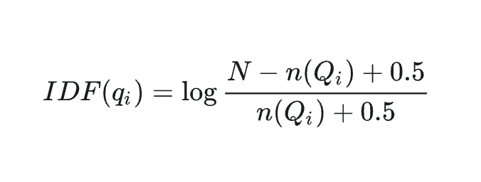

# Golang实现搜索引擎


## 概述
主要包括三个部分:
1. **网络爬虫**:爬取尽可能多的网页;
2. **网页分词**:利用`jieba`库对网页内容进行分词,并存储分词结果（格式为:文档id,文档长度,词频,分词偏移-文档id,文档长度,词频,分词偏移）;
3. **搜索页面**:提供一个前端页面,用户输入搜索词,基于分词相关性,返回结果;


不要害怕，整个逻辑很简单，逻辑拆分的很独立，便于理解。项目地址: https://github.com/gofish2020/easysearch


## 如何启动

1. 在当前目录执行 `docker-compose up -d`命令,启动docker环境;(进入 mysql的docker内部,查询下 `select host,user,plugin,authentication_string from mysql.user;` 需要修改root的host 为 %，然后重启mysql,**否则外部是连接不上mysql**) 默认用户名为:root 密码:1 端口: 3306
2. 修改 `easysearch.ini`文件中，关于数据库的配置信息
3. 执行 `./easysearch spider` 命令(可以重复执行),会进行网页数据的爬取,结果保存到`spider库t_source`表中;
4. 执行`./easysearch dict`命令(可以重复执行),会对上述爬取的网页进行分词,结果保存在 `dictionary库 t_dict`表中;
5. 执行 `./easysearch`命令,启动Web服务器,浏览器输入 `http://127.0.0.1:8080`输入关键词,点击搜索
效果如下:


## 基本原理

### 1.网络爬虫

既然要做搜索引擎，那么我们就需要拥有数据供我们搜索。。数据来源于哪里？数据全部都在互联网上，别人不会主动把数据按照统一格式提供给我们的。所以，只能自己去爬取。

那么爬取的思路是怎样的？

爬取的思路：从某一个url开始，遍历互联网上的所有的url。比如我们从`https://hao123.com`这个url开始，通过http请求，获取到整个网页数据，我们将网页数据保存到数据库中。同时解析网页数据，将页面中的所有的`a`标签中的 `href`属性全部提取出来，这些新的url继续作为我们待爬取的链接。这样就不会源源不断的产生新的url。

这个理论就是：网页的“六度分隔理论”：从一个网页到另外一个网页，最多只需19次点击。


源码位置： `db/spider.go`

`t_source`表结构
```sql
CREATE TABLE `t_source` (
  `id` bigint unsigned NOT NULL AUTO_INCREMENT COMMENT '自增id',
  `html_len` bigint unsigned NOT NULL DEFAULT '0' COMMENT '文档长度',
  `title` varchar(1000) CHARACTER SET utf8mb4 COLLATE utf8mb4_unicode_ci NOT NULL DEFAULT '' COMMENT '标题',
  `url` varchar(1024) CHARACTER SET utf8mb4 COLLATE utf8mb4_unicode_ci NOT NULL DEFAULT '' COMMENT '链接',
  `md5` varchar(32) CHARACTER SET utf8 COLLATE utf8_unicode_ci NOT NULL DEFAULT '' COMMENT 'url对应的md5值',
  `html` longtext CHARACTER SET utf8mb4 COLLATE utf8mb4_unicode_ci COMMENT '页面文字',
  `host` varchar(255) CHARACTER SET utf8mb4 COLLATE utf8mb4_unicode_ci NOT NULL DEFAULT '' COMMENT '域名',
  `craw_done` tinyint NOT NULL DEFAULT '0' COMMENT '0 未爬 1 已爬 2 失败',
  `dict_done` tinyint NOT NULL DEFAULT '0' COMMENT '0 未分词 1 已分词',
  `deleted_at` timestamp NULL DEFAULT NULL,
  `created_at` timestamp NOT NULL DEFAULT CURRENT_TIMESTAMP COMMENT '插入时间',
  `updated_at` timestamp NOT NULL DEFAULT CURRENT_TIMESTAMP ON UPDATE CURRENT_TIMESTAMP COMMENT '插入时间',
  PRIMARY KEY (`id`),
  UNIQUE KEY `md5` (`md5`)
) ENGINE=InnoDB AUTO_INCREMENT=0 DEFAULT CHARSET=utf8mb4 COLLATE=utf8mb4_unicode_ci;
```

思路如下：
- 从表`t_source`中查询爬取状态为 `craw_done=0` 【未爬取】的一组url
- 针对每一个url发送http请求 `queryUrl`; 如果这里你需要禁止爬取处于黑名单中的url，那只需要爬取之前判断下域名，是不是在黑名单里面，如果在的话，就直接跳过爬取，同时设定为已爬去即可
- 如果可以正常爬取成功，利用 `goquery`这个库，提取网页的文本数据并保存到数据库中；
- 同时利用`goquery`库，对该网页进行标签遍历，提取其中的`a`标签中的url，并保存到数据库中（这里要记得去重，因为同一个页面的中会存在相同的url（局部去重），而且不同的页面中也会存在相同的url（全局去重）），避免无意义的重复爬取。

因为整个中文互联网的数据大概是400+万个网站，3000亿+网页。如果只爬取1%的网页，那也有30亿。所以，如果想在生产环境上实现爬虫，代码肯定是要做优化的。

比如：
分表：表肯定是要分表，按照单表2000w行计算的话，100个表就是20亿，大家可以分成256个表；启动256个协程针对每个表进行单独爬取，可以大幅提高效率。

去重：url我们可以进行md5化，相同的url一定md5值相同。同时可以利用md5值，对256求余，得到应该放到哪个表中（比如md5值为 f2898798732,我们可以直接截取[**f2**]898798732，将16进制f2转成10进制，不就是256的余数嘛）；

全局去重： 因为要通过查mysql数据库才可知道是否重复。优化方案：可以将md5值放到redis集合中，提高查询的效率，为了避免redis大key，依然可以分成多个key。制订好规则即可。（当然用布隆过滤器的思路也可以）


```go
// craw_done = 0  从数据库一次获取limit个url，然后进行处理
func DoSpider(limit int) {
	//1. 指定使用spider数据库
	mysqlDB.Exec("use " + SpiderDBName)

	//2. 执行t_source表查询
	srcs := []Source{}
	//mysqlDB.Raw(" select id,url,md5 from t_source where craw_done=0 order by id asc limit 0,?", limit).Find(&res)
	mysqlDB.Model(&Source{}).Select([]string{"id,url,host,md5"}).Where("craw_done = ?", 0).Limit(limit).Order("id asc").Find(&srcs)

	for _, src := range srcs {
		//爬取信息
		doc := queryUrl(src.Url, 3)
		if doc == nil { // 爬取失败
			src.CrawDone = "2"
			if src.Host == "" {
				u, _ := url.Parse(src.Url)
				src.Host = strings.ToLower(u.Host)
			}
			if src.Md5 == "" {
				src.Md5 = tools.GetMD5Hash(src.Url)
			}
			src.HtmlLen = 0
			src.UpdatedAt = time.Now()
			mysqlDB.Model(&src).Select("craw_done", "host", "md5", "html", "html_len", "title", "updated_at").Updates(src)
		} else {

			src.CrawDone = "1"
			src.Html = tools.StringStrip(strings.TrimSpace(doc.Text()))
			src.HtmlLen = uint(utf8.RuneCountInString(src.Html))
			src.Title = tools.StringStrip(strings.TrimSpace(doc.Find("title").Text()))
			src.UpdatedAt = time.Now()
			if src.Md5 == "" {
				src.Md5 = tools.GetMD5Hash(src.Url)
			}
			if src.Host == "" {
				u, _ := url.Parse(src.Url)
				src.Host = strings.ToLower(u.Host)
			}

			// 爬取成功,更新数据库
			res := mysqlDB.Model(&src).Select("craw_done", "html", "html_len", "title", "update_at", "md5", "host").Updates(src)
			if res.RowsAffected > 0 {
				fmt.Println("已成功爬取", src.Url)
			}

			uniqueUrl := make(map[string]struct{}) // 当前页面中的a链接去重
			// 解析html，提取更多的a链接，保存到数据库
			doc.Find("a").Each(func(i int, s *goquery.Selection) {
				//
				href := width.Narrow.String(strings.Trim(s.AttrOr("href", ""), " \n"))
				_url, _, _ := strings.Cut(href, "#") // 去掉 #后面的
				_url = strings.ToLower(_url)

				if _, ok := uniqueUrl[_url]; ok { // 重复
					return
				}
				uniqueUrl[_url] = struct{}{}

				if tools.IsUrl(_url) { // 有效 url

					// 这里还需要做一次全局去重复( 如果数量大，可以用redis来记录url是否记录过)
					md5 := tools.GetMD5Hash(_url)
					u, _ := url.Parse(_url)

					src := Source{Md5: md5, Url: _url, Host: strings.ToLower(u.Host), Model: gorm.Model{CreatedAt: time.Now(), UpdatedAt: time.Now()}}

					result := mysqlDB.First(&src, "md5 = ?", md5)

					if errors.Is(result.Error, gorm.ErrRecordNotFound) { // 说明不存在
						// 保存到数据库中
						result := mysqlDB.Create(&src)

						if result.Error == nil && result.RowsAffected > 0 {
							fmt.Println("插入成功", _url)
						}
					}
				}
			})
		}

	}
}
```

### 2.网页分词

说到分词，就说下倒排索引。

比如有下面3篇文档
|  ID   |   Doc   
| ----  |   ---- 
|   1   |   热爱事业   
|   2   |   爱生活   
|   3   |  我爱生活    

然后利用分词库，对文档内容进行分词
|  ID   |   Doc      |    Dict        
| ----  |   ----     |    ----
|   1   |   热爱事业  |   热/爱/事业  
|   2   |   爱生活    |   爱/生活      
|   3   |  我爱生活   |  我/爱/生活    


将分词结果 和 ID调换下位置，也就是Dict作为唯一键，ID 作为值，建立分词表

|Dict|ID|
|----|----|
|热|1,0-|
|爱|1,1-2,0-3,1-|
|我|3,0-|
|生活|2,1-3,2-|
|事业|1,2-|

以这条记录`【爱  1,1-2,0-3,1- 】`解释下含义：
```
1,1表示 爱出现在文档1的偏移量1的位置
- 表示文档之前的分割
2,0 表示 爱出现在文档2的偏移量0的位置
- 表示文档之前的分割
3,1 表示 爱出现在文档3的偏移量1的位置
- 表示文档之前的分割
```

当我们要搜索【爱】字的时候，就可以从这个分词表，查找到 1,1-2,0-3,1-这条内容，然后解析这串字符串得到文档ID，根据文档ID再查询出文档内容，就是倒排索引。


当然存储分词的方式很多，你可以放到MYSQL/MongoDB中，也可以自己实现一个数据库做分词的快速检索。

比如ES中，利用前缀树 给这些分词再做一层索引(Term Index)，通过Term index可以快速地定位到term dictionary的某个offset（相当于缩小了查询的范围），然后从这个offset位置 在Term Dictionary中往后顺序查找，定位要搜索的词，最后返回分词对应的文档列表 (Posting list)。

如果不加Term Index，那么搜索分词就需要在 Term Dictionary中通过二分法来查找，每次查找都对应一次磁盘IO（因为Dictionary数据量肯定很大，一定是在磁盘中存储的，不可能全量都放在内存中的）。通过增加Term Index，并且经过压缩，这个前缀树的数据量足够的小，可以直接放在内存中。这样可以直接在内存中定位到分词的大概位置，然后再经过一次磁盘IO，在 Term dictionary 中定位出分词，那速度肯定就更快了。


源码位置： `/db/dict.go`

我们这里将分词保存到Mysql数据库中（等价于用B+树作为词汇的索引了）

`t_dict`表结构:
```sql
CREATE TABLE `t_dict` (
  `id` bigint unsigned NOT NULL AUTO_INCREMENT COMMENT '自增id',
  `word` varchar(255) DEFAULT '' COMMENT '分词',
  `positions` longtext CHARACTER SET utf8mb4 COLLATE utf8mb4_bin COMMENT '文档id,文档长度,词频,分词偏移-文档id,文档长度,词频,分词偏移',
  `deleted_at` timestamp NULL DEFAULT NULL,
  `created_at` timestamp NOT NULL DEFAULT CURRENT_TIMESTAMP COMMENT '插入时间',
  `updated_at` timestamp NOT NULL DEFAULT CURRENT_TIMESTAMP ON UPDATE CURRENT_TIMESTAMP COMMENT '更新时间',
  PRIMARY KEY (`id`),
  UNIQUE KEY `word` (`word`)
) ENGINE=InnoDB AUTO_INCREMENT=26149 DEFAULT CHARSET=utf8mb4 COLLATE=utf8mb4_0900_ai_ci;

```
这里解释下字段`positions`的含义：
比如 “我爱番茄炒蛋”这个文档（假设文档id为：20），经过分词后，结果为 ”我/爱/番茄/炒/蛋“，保存到 `t_dict`表为
|word|positions|
|----|----|
|我|20,6,1,0-|
|爱|20,6,1,1-|
|番茄|20,6,1,2-|
|炒|20,6,1,4-|
|蛋|20,6,1,5-|

```
格式为： 文档id,文档长度,词频,位置1,位置2-

文档id:表示词汇出现在哪些文档中
文档长度：记录文档id对应的长度
词频：表示词汇在文档中出现的次数；比如 【我爱爱我】假如分词结果为【我/爱/爱/我】，那么，我和爱都各自出现了2次
位置1,位置2,位置N ： 表示文字在文档中的偏移位置（不是字节数，而是字符数）
- ：表示多个文档的分词线

```

大家可能会好奇，为什么要存储这些东西？其实这个是因为接下来的文章的第三部分，BM25算法需要这些值。（这里你是用逗号分隔，还是 - 分割 这些没影响）

实际效果如下：


代码思路如下：

- 初始化 黑名单词汇（比如 "的"  "("  ")"  等等，这些词基本每个文档都会存在，没有意义，直接忽略对这些词汇的处理）
- 从数据库`t_source`中查找已爬取（craw_done = 1），但是未分词（dict_done = 0）的多条记录
- 利用 `jieba` 库，对爬取的网页进行分词,得到一个分词数组`words`
- 对每个词汇统计该词汇在**当前的文档**中出现的【词频/位置】信息
- 最后将词汇的信息进行汇总，保存到 `t_dict`表中


```go

// craw_done = 1 and dict_done = 0 分词多少条记录
func DoDict(limit int) {

	// 1.使用 spider 库
	mysqlDB.Exec("use " + SpiderDBName)

	// 黑名单词汇
	once.Do(func() {
		blacks := []BlackList{}
		mysqlDB.Model(&blackList).Order("id asc").Find(&blacks)
		for _, black := range blacks {
			blackWord[black.Word] = struct{}{}
		}

	})
	// 2.查询
	var srcs []Source
	mysqlDB.Model(&Source{}).Where("dict_done = ? and craw_done=1 and id > ?", 0, maxId).Limit(limit).Order("id asc").Find(&srcs)

	batchUpdate := make(map[string]string)

	for _, src := range srcs {

		fmt.Println("文档id:", src.ID)
		htmlLen := utf8.RuneCountInString(src.Html)               // 页面字符数
		words := jieba.JiebaInstance.CutForSearch(src.Html, true) // 页面分词

		// 比如：我爱你你爱我，分词后就是：我/爱/你/你/爱/我 -->> 分词结果就是有2个我2个你2个爱
		pos := 0
		statWork := make(map[string]wordInfo) // 一个网页中，每个词汇出现的频次以及位置
		for _, word := range words {

			// 不区分大小写 比如 baidu 和 BAIDU是 一个词汇
			newWord := strings.ToLower(width.Narrow.String(word)) // 转半角
			wordLen := utf8.RuneCountInString(newWord)

			// 判断是否为黑名单词汇
			if _, ok := blackWord[newWord]; ok {
				pos += wordLen
				continue
			}

			if winfo, ok := statWork[newWord]; !ok {
				statWork[newWord] = wordInfo{
					count:     1,
					positions: []string{strconv.Itoa(pos)},
				}
			} else {
				winfo.count++
				winfo.positions = append(winfo.positions, strconv.Itoa(pos))
				statWork[newWord] = winfo
			}

			pos += wordLen
		}

		// 汇总结果
		for word, wordInfo := range statWork {

			// 文档id,文档长度,词频,位置1,位置2-
			infoString := strconv.FormatUint(uint64(src.ID), 10) + "," + strconv.Itoa(htmlLen) + "," + strconv.Itoa(wordInfo.count) + "," + strings.Join(wordInfo.positions, ",") + "-"

			batchUpdate[word] += infoString

		}

		// 更新t_source表分词状态
		src.DictDone = "1"
		src.UpdatedAt = time.Now()
		mysqlDB.Model(&src).Select("dict_done", "updated_at").Updates(src)

		if src.ID > maxId {
			maxId = src.ID
		}

	}

	// 开启一个新链接，批量更新 t_dict
	mysqlDB.Connection(func(tx *gorm.DB) error {
		tx.Exec("use " + DictDBName)

		tx = tx.Begin()
		for word, positions := range batchUpdate {
			tx.Exec(" insert into "+dictTable.TableName()+" (word,positions) values (?,?) on duplicate key update positions = concat(ifnull(positions,''), ?) ", word, positions, positions)
		}
		tx.Commit()
		return nil
	})

}

```


### 3.搜索页面

当我们爬取完网页，并且分词完成以后，那接下来就要对外提供服务了。

效果如下：


当我们输入一个关键词以后，到底是怎么知道，我们的这个关键词应该最后匹配哪些文档返回给用户呢？

这就要说到 BM25算法（**某一个目标文档（Document）相对于一个查询关键字（Query）的“相关性”**），本质就是一组数学公式。我们只需要套公式即可。

【公式1】
判断一个词语与一个文档的**相关性权重**，较常用的就是TF-IDF算法中的IDF



公式解释：
- N 表示待检索文档的数目（其实就是已经完成分词的网页总数量）
- n(Qi) 表示包含被搜索词的文档数量（其实就是包含该词的网页数量，这个不就是上面分词结果中`positions`字段保存的值嘛，用多个-分割的文档id数量）
- 最终的结果IDF ： 说人话就是， 比如“的”这个词，几乎每个文档中都包含，那么就说明这个“的”词就不重要，那么词汇和文档的相关性就不强。（再比如：我们去公安局想找个叫毛蛋的人，全国叫这个名字的会非常多，说明毛蛋这个词太没特色了）


【公式2】
**相关性得分**


- k1 k2 b为调节因子，通常为 k1 = 2 b = 0.75
- fi 表示词汇在文档中出现的频次（上面的positions中有保存）
- Dj 表示文档的长度（上面的positions中有保存）
- avgDj 表示所有文档的平均长度


【最终公式为】


将词汇的相关性权重IDF * 词汇的相关性得分 ，得到的就是词汇和文档的相关性，将文档的得分累加起来，文档的得分越高，说明和被搜索词的相关度也越高，对于用户来说越有价值。做个倒序排列返回给用户即可。


源码路径:`db/search.go`

结合注释，照着上面的公式很好理解。

注意一点：用户输入的搜索词，到了我们服务端，也是要进行分词的，然后用分词后的词汇，来进行计算


```go

func Search(words []string) []SearchResult {

	statRes := StatResult{}
	mysqlDB.Exec("use " + SpiderDBName)
	mysqlDB.Raw("select count(1) as count, sum(html_len) as total from "+srcTable.TableName()+" where dict_done=?", 1).Find(&statRes)

	// N 已经完成分词的文档数量
	N := statRes.Count
	if N == 0 { // do nothing
		return nil
	}

	// 平均文档长度
	avgDocLength := float64(statRes.Total) / float64(statRes.Count)

	// 记录文档的总得分
	docScore := make(map[string]float64)

	mysqlDB.Exec("use " + DictDBName)

	// 每次针对一个词进行处理
	for _, word := range words {

		var dict Dict
		mysqlDB.Model(&dictTable).Where("word = ?", word).Find(&dict)
		if dict.ID == 0 {
			continue
		}

		positions := strings.Split(dict.Positions, "-")
		positions = positions[:len(positions)-1] // 去掉最后一个【符号-】

		// NQi 含有这个词的文档有多少个
		NQi := int64(len(positions)) // -1因为尾部多了一个【符号-】
		// IDF ： 如果一个词在很多页面里面都出现了，那说明这个词不重要，例如“的”字，哪个页面都有，说明这个词不准确，进而它就不重要。
		IDF := math.Log10((float64(N-NQi) + 0.5) / (float64(NQi) + 0.5))

		// 固定值
		k1 := 2.0
		b := 0.75
		for _, position := range positions { // 这里其实就是和 word 关联的 所有文档

			docInfo := strings.Split(position, ",") //  文档id,文档长度,词频,位置1,位置2-

			//Dj :文档长度
			Dj, _ := strconv.Atoi(docInfo[1])
			//Fi :该词在文档中出现的词频
			Fi, _ := strconv.Atoi(docInfo[2])

			// 本词和本文档的相关性
			RQiDj := (float64(Fi) * (k1 + 1)) / (float64(Fi) + k1*(1-b+b*(float64(Dj)/avgDocLength)))

			// 汇总所有文档的相关性总得分
			docScore[docInfo[0]] += RQiDj * IDF
		}
	}

	// 根据积分排序文档

	docIds := make([]string, 0, len(docScore)) // 文档ids
	for id := range docScore {
		docIds = append(docIds, id)
	}

	sort.SliceStable(docIds, func(i, j int) bool {
		return docScore[docIds[i]] > docScore[docIds[j]] // 按照分从【大到小排序】
	})

	// 默认取 20个
	limit := 20
	if len(docIds) < limit {
		limit = len(docIds)
	}
	docIds = docIds[0:limit]

	// 然后利用id回表查询文档内容
	sousouResult := make([]SearchResult, 0)
	mysqlDB.Exec("use " + SpiderDBName)
	for _, docId := range docIds {

		var src Source
		mysqlDB.Table(src.TableName()).Where("id = ?", docId).Find(&src)

		// 从Html中截取 一段文本作为简介（去掉了其中的ascii编码字符）
		rep := regexp.MustCompile("[[:ascii:]]")
		brief := rep.ReplaceAllLiteralString(src.Html, "")

		briefLen := utf8.RuneCountInString(brief)
		if briefLen > 100 {
			brief = string([]rune(brief)[:100])
		}

		sousouResult = append(sousouResult, SearchResult{
			Title: src.Title,
			Brief: brief,
			Url:   src.Url,
		})
	}

	return sousouResult
}
```


## 总结

整个搜索引擎的本质就是利用分词库`jieba`对网页内容进行分词，将分词结果保存起到`MYSQL`中。当用户搜索到时候，利用 数学公式计算 文档和搜索词之间的相关性得分，得分越高越是我们想要的文档。

可能有人说，直接用ES不就可以了。。确实没毛病。通过本项目，至少可以让你知道，不用ES你也可以做到，而且让你有种更直观的感受。


通过上面的公式其实也可以看到，就是概率公式，当只有少量的网页数据，除非你的搜索词很”特别“，不然结果并不准确。当数据量大了以后，匹配的准确性就会很高，


## 参考资料：
【NLP】非监督文本匹配算法——BM25 https://zhuanlan.zhihu.com/p/499906089

2021年中国互联网发展基本情况分析 https://www.chyxx.com/industry/1104557.html


elasticsearch 倒排索引原理 https://zhuanlan.zhihu.com/p/33671444